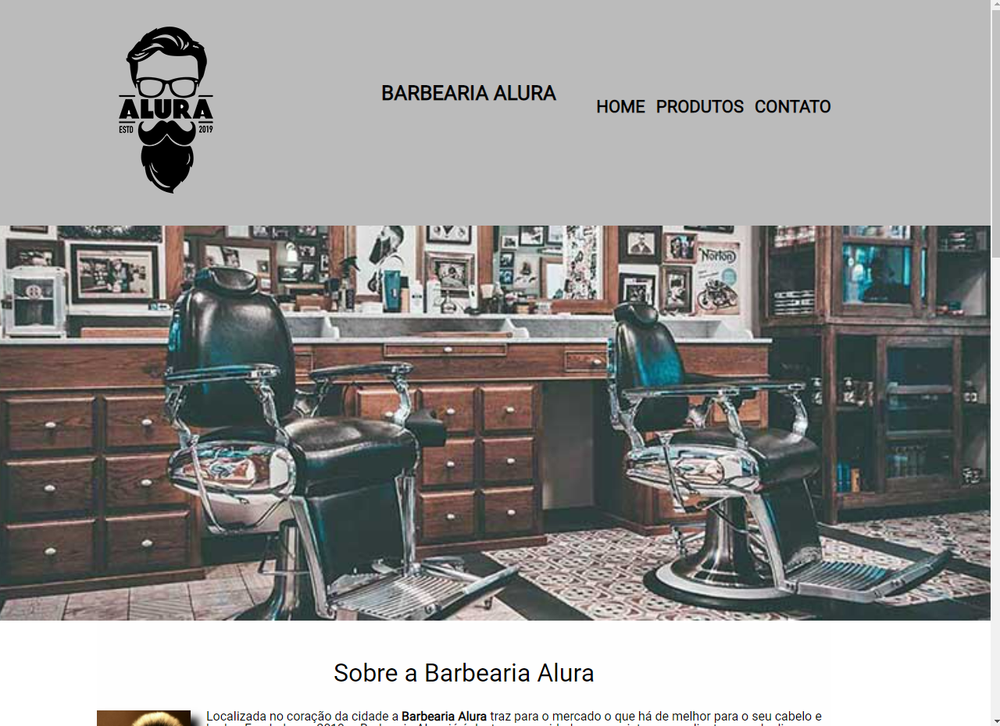

<h1 align="center"> Barbearia Alura </h1>

A Barbearia Alura é uma página proposta para o aprendizado e implementação das funções básicas do HTML e CSS.  

 

  

## Tecnologias

Este projeto foi desenvolvido com as seguintes tecnologias:

- HTML 
- CSS

## Projeto

Este projeto foi desenvolvido através das aulas de HTML e CSS do programa Oracle Next Education em parceria com a Alura, a página simula um site de barbearia. O desenvolvimento da página foi importante para o entendimento e aprendizado das principais funções do HTML e CSS, desde tags semânticas até posicionamento e estilização.

- [Visite o projeto online:](https://arthur-gabriel-silva2003.github.io/barbearia-alura/home.html)

